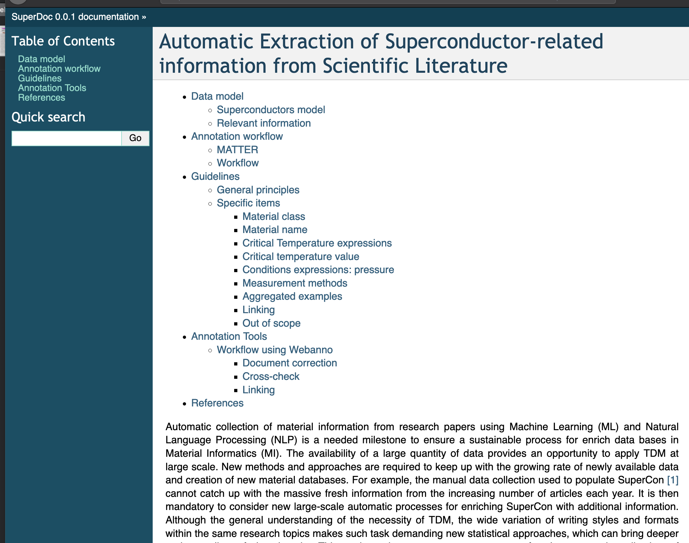

# superconductors-documentation

Documentation guidelines about the project for automatic creation of database of superconductors related information. 

This documentation can be viewed on [falcon](http://falcon.nims.go.jp/superconductors-documentation).



The site is updated on-the-fly.  

## Getting started

We use reStructured TExt using the utility [Sphinx](https://www.sphinx-doc.org/en/master/) which provide several output formats. Currently we support XML and PDF. 

To build this documentation locally, we recommend to create a virtual environment such as `virtualenv` or `conda`:  

> conda create -name guidelines 
> conda activate guidelines
>
> conda install sphinx 

### Build HTML site

To build the documentation as a website: 

> sphinx-build -b html sourcedir builddir

#### Automatic build

Sphinx allows automatic build, reload and visualise on a webservice spawned at-hoc. 
This is very convenient for checking the final result of your work. 
In order to do so, you need `sphinx-autobuild`. 

**NOTE**: If you are working from a git repository it's recommended to exclude the `build` directory from the source (via `.gitignore`).

You can launch the automatic build using: 

> sphinx-autobuild source build 

you can access the service by opening the browser at `http://localhost:8000`.

### Build PDF 

You can export this document as PDF using `rst2pdf`. 

Even if you have conda, you should install the version provided by pipy: 

> pip install rst2pdf

Then you need to modify your `config.py` by adding the following information: 

```python
extensions = ['rst2pdf.pdfbuilder']
pdf_documents = [('index', u'filename', u'Title', u'Author')]
``` 

and build using 

> sphinx-build -b pdf sourcedir builddir

and a file with the specified name will be created in `builddir`.