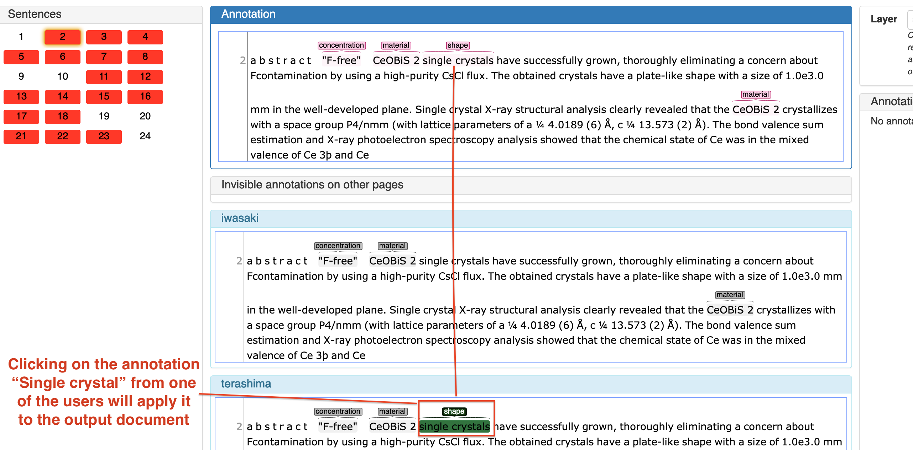
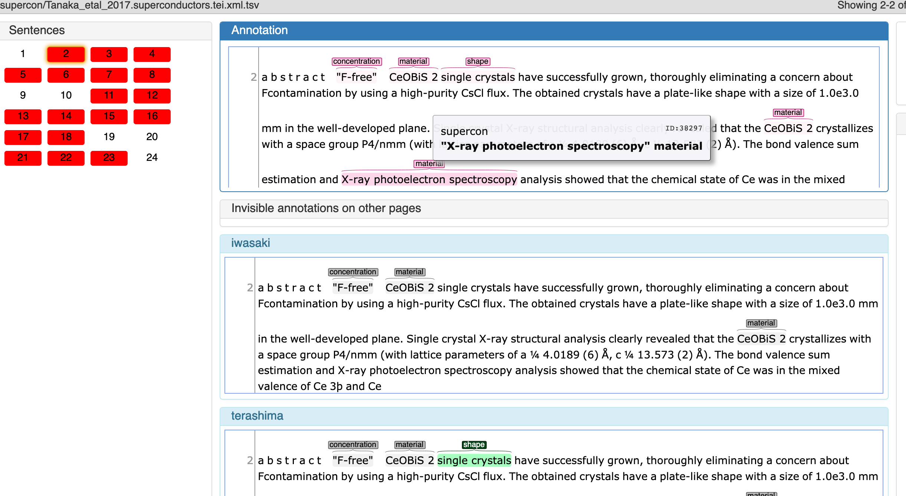
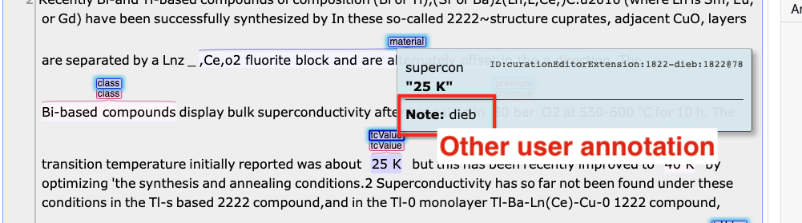
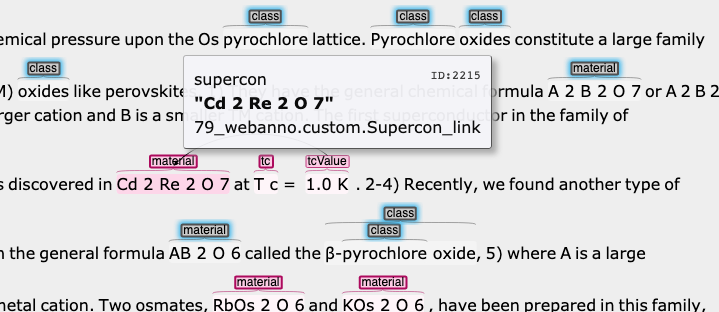

.. _Webanno GitHub page: https://github.com/webanno/webanno
.. _Webanno: https://webanno.github.io
.. _Webanno tutorial: https://www.youtube.com/playlist?list=PLvYKmi8P7TYdC-7A_VT4td95629aZIwDb
.. _Inception GitHub page: https://github.com/webanno/inception
.. _Inception: https://inception-project.github.io/
.. _Inception tutorial: https://www.youtube.com/playlist?list=PL5Hz5pttaj96SlXHGRZf8KzlYvpVHIoL-
.. _Inception user guide: https://inception-project.github.io//releases/0.15.0/docs/user-guide.html
.. _doccano: http://github.com/chakki-works/doccano
.. _prodigy: https://prodi.gy/
.. _GitLab issues project page: https://gitlab.nims.go.jp/a017873/superconductors-documentation/issues
.. _report on market research: https://github.com/doccano/doccano/wiki/Report-on-Market-Research

.. _Annotation tools:

Annotation Support Tools
~~~~~~~~~~~~~~~~~~~~~~~~
This section describe the use of the annotaion support tools, namely the annotation tool Inception.

Overview
^^^^^^^^

There are three mains tasks each user is required to perform:
 - correct documents (annotation)
 - cross-check other annotators-corrected documents (curation)
 - report issues or questions (documentation)

`Inception`_ can be accessed via web. After the login the user will reach a view with all the assigned projects:

In the scope of this project, each batch of documents will be assigned to a different Inception "project".

.. _annotation:

Document correction (Annotation)
^^^^^^^^^^^^^^^^^^^^^^^^^^^^^^^^

To start the anntation process, select ``Annotations``

and then a document from the available list.

.. figure:: images/file-list.png
   :alt: File selection

The annotated document look like:

The correction task can be summarised in the following actions:
    (1) select the annotation and modify the label or,
    (2) move the annotation (see warning below), when for example there are character missing or when the annotation is not aligned (see below, in red the correct annotation span)

    .. figure:: images/example-annotation-alignment.png
        :alt: Annotation alignment

        Annotation alignment

    (3) remove the annotation, when is not relevant (for example, if a ``<tcValue>`` is identifying the temperature of annheling).

.. warning:: The tool does not support dragging annotations. To move an annotation, it must be deleted and added as a new annotation in the new position.

.. note:: The tool will log you off after 30 seconds of inactivity. Any modification is saved automatically.

Once the document has been completely annotated, the user has to click on the ``Finish`` button (lock icon) to lock the document and move it to the next step of the workflow: the cross-check (curation) task.

    Icon to mark a document as "completed" and move it to the next step of the workflow

.. note:: If you wish to modify a document that has been already ``closed``, contact one of the admins.

Cross-validation (Curation)
^^^^^^^^^^^^^^^^^^^^^^^^^^^

After a document has been annotated by an annotator it requires to be cross-validated by a domain-expert.

The Cross-validation is referred also as Curation and can be done in two ways:
 - through the Curation interface
 - through the Curation-in-annotation interface

.. note:: While curating, if some differences between the annotated document and the guidelines are found, they should be discussed first between annotators and reported using the `GitLab issues project page`_, to keep track and to be integrated in the guidelines.

Classic Curation interface
--------------------------
To start the cross-validation, firstly open the Curation interface

.. figure:: images/inception-start-menu-curation.png
   :alt: Curation

select a document and verify the annotations that are shown in the **top box**:

In this example there there are two annotators (lower boxes) which have some disagreement.
The curator (the person who is currently cross-validating), should make changes, when needed, to the document by select already annotated elements from the annotators or add new ones.

The curator can propagate annotations by clicking on it to have it in the output (top box)

(See below)

The annotation ``single crystal`` is propagated in the output file by clicking the annotation from one of the annotators.

The curator can also add new annotation by highlight the text and selecting the label from the right panel (as explained for the task of annotation/correction).

Another example showing a new annotation that wasn't identified by any of the annotators (**this example is conceptually wrong, just for illustrating the principle**):

New Curation interface (Curation-in-annotation)
-----------------------------------------------
The ``Curation-in-annotation`` interface is a new concept developed recently by the Inception team.

It provides the possibility to visualise annotations from multiple users in a single document, therefore using the whole space available in the screen. One of the problem of the curation interface is that it splits the screen makes it hard to use it properly.

In any projects:
    1) enter "annotation",
    2) click second icon from the top,
    3) tick on the user you want the annotations to be visualised (who annotated)
    4) save - after clicking that button, you will see the annotations from the user appearing
    5) click on settings, and
    6) select to save the document as "curation document" - click on "apply changes"

  How to access the curation-in annotation.

The violet-highlighted annotations belongs to the annotator while the other annotations (they can be pink or any other colors, depending on the selected palette), are the curation output.

   Other users annotations are violet

It's possible to identify the owner of each annotation, by hovering the mouse on top of it:

   To distinguish the other annotations, just hover with the mouse and you will see the identification information

Annotations can be added manually by selecting the text in the classical way, but is possible to click on the annotator's annotations to replicate in the curation output.

   Example of copying the annotation from one of the annotators ot the curation document

It's possible to merge all annotator annotations by clicking on the "recycle icon":

   Example of how to merge all annotations from others annotators

Linking
^^^^^^^
The linking is the process of linking different entities as discussed in the annotation guidelines page :ref:`Guidelines`.

After identifying two entities (or labels), the user can create the link by dragging and dropping from the origin to the destination (**the order does matter**).

once the link is made, it is possible to select the type of relationship:

Recommendation system
^^^^^^^^^^^^^^^^^^^^^

The recommendation system that allow suggestion of entities based on what previously annotated. This can be configured using a Named Entities Recognition engine or a string matching approach.

The user can accept the suggestion just by clicking on them. Beside the precision/recall of the suggestions, this allow users to reduce dramatically errors due to overlooking.

Global search
^^^^^^^^^^^^^
This function is basically a find and replace over multiple files.

.. warning:: Massive annotation modification cannot be undone (unless resetting **all modification** to the documents), take extra care to use this feature. We recommend also to always limit the search/replace to the the current document.

For adding new annotations on a specific value:

To modify (add/remove) all annotations with a specific class, the user can use some advanced parameters in HTML:

