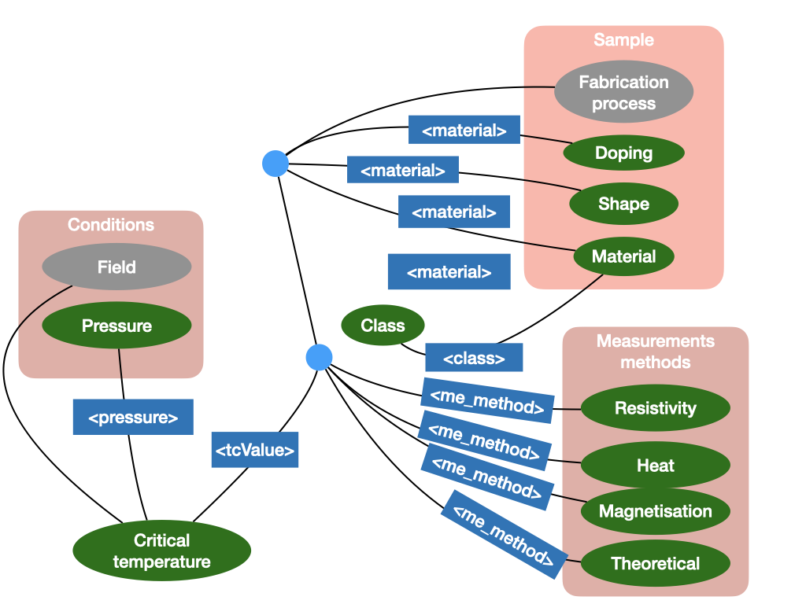
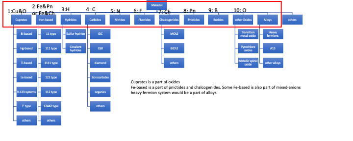

.. _Data model:

Data model
~~~~~~~~~~

This page describe the model for superconductor-related information. This abstraction aims to cover all information contained in superconductor-related research papers. We based our design on the structure of SuperCon, since an already established manually extracted database and extensively used worldwide for both data-analysis and superconductor materials research.

Superconductors model
=====================
The schema below illustrates the model. The blue boxes identify the tag-set that is currently covered by our project. The green ovals are the information (properties, materials, conditions) that are described in the literature.

   Superconductors model schema

**Class**: Classes of materials. Like in other domains, materials belong to different classes based on their nature and chemical components, for example, cuprate, iron-based, and so on. Such information has a sparse distribution (one, two mentions per document) and could also be retrieved from general chemistry databases [to be checked].

A **Material sample** is an "instance" of a specific material designed for experiment and measurement. A sample is composed by several characteristics, like doping rates, crystal structure (mono-crystal, poly-crystal) and by their shape (wire, thin film, powder). Material sample properties are affected also by the fabrication process, which is often described in papers. Fabrication process is, for the time being, out of scope.

**Conditions** (or Experimental Conditions) describe the conditions applied in one experiment. In practical terms, it consists of applied physical quantities, such as pressure or magnetic field to the sample where the critical temperature is measured.

**Measurement methods** are methods used for measuring the superconducting critical temperature.

Relevant information
====================

In collaboration with superconductor domain experts, we identified the relevant information for superconductor research, summarised in the following table:

===============================  ============================================================================================  ==============================
Name                                Description                                                                                 Type
===============================  ============================================================================================  ==============================
Tc                                  Critical Temperature                                                                        result
Tc onset                            Temperature at which the electrical resistance starts to decrease sharply                   result
Tc offset                           Temperature at which zero resistance starts to appear                                       result
Hc1                                 Upper Critical field                                                                        property value
Hc2                                 Lower Critical field                                                                        property value
Ic                                  Critical current                                                                            property value
Jc                                  Critical current density                                                                    property value
Hivr                                Irreversibly field                                                                          property value
P                                   Critical pressure                                                                           condition
M                                   Magnetic field                                                                              condition
Material                            Material the sample is composed                                                             sample
Substrate                           Material used in the sample for certain characteristics                                     sample
Crystal structure space group       Crystal configuration (single, poly)                                                        sample
Sample preparation shape            single crystal, poly crystal, thin film or wire.                                            sample
Fabrication process                 Process of fabrication of the sample                                                        sample
Measurement method                  Method used for measuring the superconducting critical temperature                          measurement
===============================  ============================================================================================  ==============================

Depending on writing style, these information are often presented as tables and plots because they summarise more effectively, giving quicker understanding to a human reader.  One plot or table can recap several experiments together without in the same space.  We focus on extracting information from text, leaving additional information for a second stage.

Class hierarchy
===============

In the following schema the class hierarchy from the domain experts:

Each class is characterised by a cardinal number followed by the main characteristic materials. The cardinal number indicate the priority on which each class can be resolved.

   Classes hierarchy
