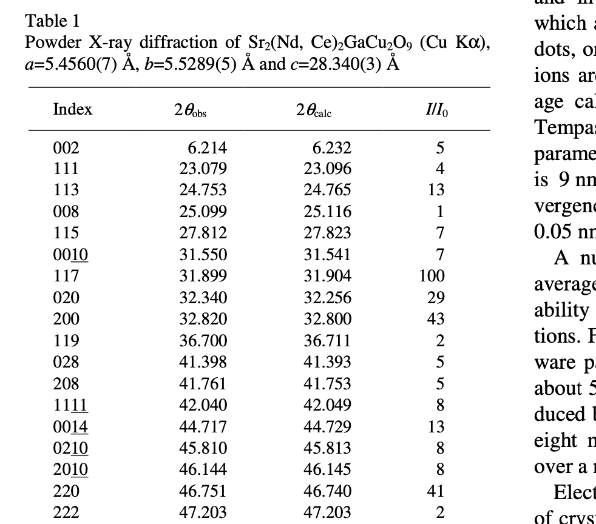
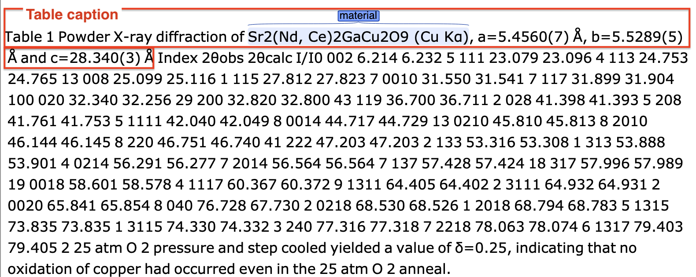
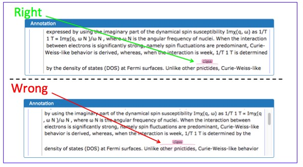
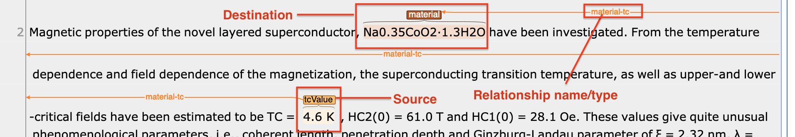
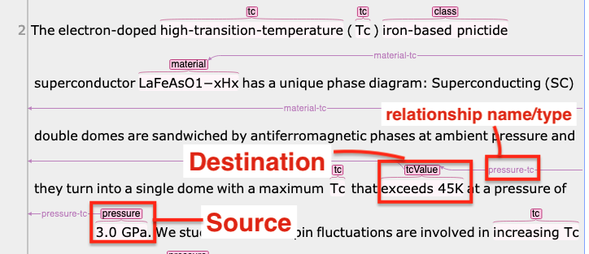
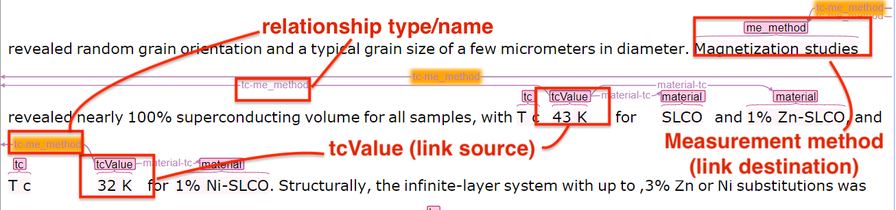

.. _GitLab project page: https://gitlab.nims.go.jp/lfoppiano/SuperMat/issues

.. _Guidelines:

Guidelines
##########

This section provides the guidelines to be followed to annotate.
First we illustrate the general principles, then each element of the tag-set is discussed separately, with examples and references.

Notations
*********

In this guidelines are used two notations:
 - XML notation, which is based on XML where each class is represented by a ``<rs>`` tag with ``@type`` attribute describing the class or label (e.g. ``something important`` of type ``<rs type="label1">`` and ``important information`` of type ``<rs type="label2">`` are the label that represent the chunk of text within the tag. We use the attributes `@xml:id` and `@corresp` to link two entities (notice that the value of the ``@corresp`` attribute require to start with `#`).
    .. code-block:: xml

        
This is an example of XML.
        We have <rs type="label1">something important</rs> and another
        <label2>important information</label2>.
        Here an example of linking <rs type="label1" xml:id="123">label 1</rs>
        to <rs type="label2" ptr="#123">label 2</rs>.

 - Brat notation, which is based on the `brat annotation tool <https://brat.nlplab.org/>`_ and provide a easier visual interface

  .. figure:: images/example-notation-brat.png
   :alt: Example notation brat

General principles
******************
The general principles apply to every annotation, as a general strategy:

- In case an annotator discover cases not covered by the guidelines, open an issue to the `GitLab project page`_ (internal link).

    .. figure:: images/gitlab-issue-screenshot.png
        :alt: GitLab issues recording page screenshot

- Annotations related to complex description should be kept simple, and systematic. If in the same sentence the same entity refers to different labels, it should be carefully revised. See an example at `#1 <https://github.com/lfoppiano/SuperMat/issues/1>`_

- Indirect references should not be annotated, e.g. the token ``it`` is only a reference to a superconductor material and should be ignored:
    ::

        The material XYZ has tc 34K. It show interesting characteristics at 22K.

Annotation boundaries
=====================

The annotation boundaries should follow these guidelines:

- articles should not be included in the annotation,

- ``superconductor`` / ``superconductors`` should not be included in the ``<material>`` annotation. For example: ``LaFeO2 superconductor`` should be annotated as ``<material>LaFeO2</rs> superconductor``

- parenthesis and other marks that are part of the name or formula, must be included and/or corrected when necessary:

    .. figure:: images/example-missing-parenthesis-in-annotation.png
        :alt: Example of missing parenthesis in annotation

        Example of missing parenthesis in annotation

Layout
======

Only text coming from the body of the document should be annotated: title, abstract, body. For what concern figures, tables and equation, we are interested only in captions.
Sometimes, unfortunately, additional elements are structured into the text body.

Text coming from table body and other part of the document not mentioned should not be annotated. For example given the following table:

    Example of original table

only the material mentioned in the caption should be annotated

    Example of annotation of a table caption

.. _values-representation:

Values representation
=====================

Values are used to represent doping ratios, variable/values information, pressures, temperatures, etc.
They are presented in several forms:

 - Atomic values, e.g.
    - ``x = 0.5`` (with variable name ``x``),
    - ``3 K`` (without variable name)

 - Intervals or ranges, e.g.
    - ``0.5 < x < 0.9``,
    - ``from 20 to 25``,
    - ``up to 30``,
    - ``up to 50``

 - Lists, e.g. ``x = 0.01, 0.2, 0.3 and 0.4``

The annotations should be added according to the following rules (called **Multiple values, ranges or intervals annotations**) (see `#1 <https://github.com/lfoppiano/grobid-superconductors-data/issues/1>`_):

- Simple values (including preceeding symbols, like circa `~` for example) are annotated including the variable name, when present, e.g.
    - we found superconductivity for ``<rs type="material">x = 0.5</rs>``.
    - the temperature is ``<rs type="tcValue">~60 K</rs>``

- Intervals and ranges should be annotated entirely, including **symbols and words representing greater than, lower than, up to**, following there are some examples:
    - ``<rs type="material">0.5 < x < 0.9</rs>``
    - ``<rs type="material">up to 0.9%</rs>``
    - ``<rs type="tcValue">from 3 to 4 K</rs>``
    - ``<pressure>up to 3 GPa</rs>``
    - ``<rs type="material">x varying from 0.5 to 0.9</rs>`` (In this case `varying` is not important, but because x is there, annotators should try to catch the variable name)

- Lists, e.g.
    - ``<rs type="material">x =0.40 and 0.44</rs>``
    - ``<rs type="material">x = 0.1, 0.2, 0.3 and 0.4</rs>``

.. note:: The idea behind is based on the fact that even complex value can be expanded and resolved on a later step. For example ``x = 0.1, 0.2`` would be resolved to two materials ``x = 0.1`` and ``x = 0.2``. In general all interval are important especially for pressures, and temperatures.

Examples
^^^^^^^^

- Example 1: ``x = 0.11 and 0.05`` are annotated as a single annotation.
    .. figure:: images/example-values-annotation-1.png
        :alt: Example multiple values annotated as a single annotations

        Example multiple values annotated as a single annotations

- Example 2: here the whole expression ``up to 9.4 GPa`` should be annotated (second Figure)
    .. figure:: images/example-values-annotation-2-wrong.png
        :alt: Example interval value wrongly annotated

        Example interval value wrongly annotated

    .. figure:: images/example-values-annotation-2-correct.png
        :alt: Example interval value correctly annotated

        Example interval value correctly annotated

- Example 3: the whole expression ``0.8-1.6 GPa`` is annotated:
    .. figure:: images/example-values-annotation-3.png
        :alt: Example interval value correctly annotated
        :scale: 50%

        Example value correctly annotated as interval

Tag set
*******

The component to be annotated are:

 - :ref:`material_class`

 - :ref:`material_name`

 - :ref:`tc_expressions`

 - :ref:`tcValue`

 - :ref:`condition_expressions`

 - :ref:`me_method`

In each section we provide a ``Motivation`` section which describes why such data is important, and ``Utilisation``, describing how we plan to use the data.

.. _material_class:

Class of materials
==================

A set of materials having similar characteristics or common strategic compounds that define their nature are represented by classes.

**Tag**: ``<rs type="class">``

**Motivation**: The material's class in the superconductors-related domain does not follow a strict definition. Some of the superconductors classes can be inferred from the composition of the materials such as cuprates, iron-based. Second-level classification is more arbitrary that domain experts learn with experience.

The class information at document level can be used for clustering, information retrieval or recommendation.

Basic rules
^^^^^^^^^^^

In general, a class is an expression that represent more than one materials, given that such materials cannot be identified from the expression itself.
For example ``R-123 (with R = Rare earth materials)`` is a class because is not possible to indistinguishably extract a deterministic list of materials (the rare earth materials might change in time). On the other hand ``X O (with X = Cu, Fr)`` represent the materials ``CuO`` and ``FeO`` which is a deterministic list of specific materials, therefore it's to be annotated as ``<rs type="material">``.

Materials can be part of more than one class.

Class and Materials can overlap (see examples :ref:`below <example-class-material-overlapping>`)

Expressions that identify a class:
 - code or definition: ``ba1111 serie``, ``11 series FeSe``, ``HDoped Ba111 serie``
 - name: ``cuprates``, ``iron-based``, ``iron-pnictide``, ``pnictide`` alone (usually referring to ``iron-pnictide``) etc...
 - chunks of text with the suffix ``-based``  are generally classes (e.g. ``iron-based``, ``BiS2-based``, ...). See `#9 <https://github.com/lfoppiano/SuperMat/issues/9#note_34815>`_.
 - (same as before) generic notation that represent more than one material, such as ``R-123`` with R representing the rare earth materials without any reference to any material. See `#18 <https://github.com/lfoppiano/SuperMat/issues/18>`_.

.. note:: Classes referred to the physical mechanism of a superconducting material, such as ``nematic``, ``BCS``, ``conventional``, ``unconventional``, ``nematic``, ``topological``, etc. should not be annotated.
  Classes of superconductors, such as ``type-I`` or ``type-II`` should not be annotated as well.
  See `#22 <https://github.com/lfoppiano/SuperMat/issues/22>`_.

.. note:: Classes should not be linked, even though the critical temperature is referred to the class, because the information is too vague to be used.

 See `discussion in #9 <https://github.com/lfoppiano/SuperMat/issues/9#note_34834>`_ and `#8 <https://github.com/lfoppiano/SuperMat/issues/8>`_

Largest match
^^^^^^^^^^^^^

In the occurrence that several terms, which are also class by themselves, are close together, then the **largest match should be annotated**. For example, in the sentence ``We report transverse field and zero field muon spin rotation studies of the superconducting rhenium oxide pyrochlore, Cd2Re2O7.``, the largest match ``rhenium oxide pyrochlore`` should be annotated. See `#33 <https://github.com/lfoppiano/SuperMat/issues/33>`_.

See extension of the rule, in the next section.

Modifiers/adjectives preceding or following the class name
^^^^^^^^^^^^^^^^^^^^^^^^^^^^^^^^^^^^^^^^^^^^^^^^^^^^^^^^^^

Modifiers of the class name **should not be annotated**. See `decision in #2 <https://github.com/lfoppiano/SuperMat/issues/2>`_.

 - If the modifier is a compound (e.g. cuprate, etc..), a structure (e.g.  pyrochlore) then should be included. Basically any word giving an idea of the composition.
 - If the modifier is not a compound (e.g. metallic, magnetic, doped, ...) then should be ignored

    Example of irrelevant modifier to be ignored

Examples:
 - ``high-tc`` in ``high-tc iron-pnictide`` should not be included in the annotation because it does not add more information (see `discussion in #2 <https://github.com/lfoppiano/SuperMat/issues/2>`_).

 - in the expression ``metallic pyrochlore oxide``, the modifier ``metallic`` should be ignored, resulting in the following annotation ``metallic <rs type="class">pyrochlore oxide</rs>``. See `comment in #9 discussion 1 <https://github.com/lfoppiano/SuperMat/issues/9#note_34804>`_)

.. _example-class-material-overlapping:

Overlap between Class and Material
^^^^^^^^^^^^^^^^^^^^^^^^^^^^^^^^^^

.. warning:: There are several cases where class and material are heavily overlapping.

 For example in the sentence
    ``Superconductivity in a pyrochlore oxide is [...]``,

 *pyrochlore oxide*, in this case is the **material** name.

 In this other example
     ``Until now, however, no superconductivity has been reported for frustrated pyrochlore oxides.``

 *pyrochlore oxides* refers at it as a class.

 When in doubt, as a rule-of-thumb, the **singular name usually refers to the material**, while the **plural name to the class**.

 See additional discussions in `#46 <https://github.com/lfoppiano/SuperMat/issues/46>`_, `#23 <https://github.com/lfoppiano/SuperMat/issues/23>`_

Additional information
^^^^^^^^^^^^^^^^^^^^^^

In this section there is a collection of discussions and information that are not belonging under any of the previous categories:

 - Classes can also be identified by formulas. See discussion in `#9 <https://github.com/lfoppiano/SuperMat/issues/20>`_.

 - The expression ``HTS`` and it's expansions ``High-Temperature superconductors`` should not be annotated (see above), there are certain cases where HTS is used in combination of the class name.
    - When the class name is a name or a unique identifier such as ``214``, ``111``, in expressions like ``214-HTS``, ``111-HTS`` then only ``214``, ``111`` should be annotated.
    - When the class name is an ambiguous identifier, such as ``Cu`` (overlap with a material or compound name), then the whole expression should be ignored.

.. _material_name:

Material name
=============

Identifies a name of one or more materials, a sample of a material, a doped sample.

**Tag**: ``<rs type="material">``

**Motivation**: The material name is the most important annotation in this dataset. It covers materials an sample, expressions with formula, names, including, when available, information about shape, doping, and other parameters.

Basic rules
^^^^^^^^^^^

The material can be expressed as follow:
 - chemical formula with variables not substituted, like ``La(1-x)Fe(x)``,
 - chemical formula with substitution variable like ``Zr 5 X 3 (X = Sb, Pb, Sn, Ge, Si and Al)``
 - with complete or partial abbreviations like ``(TMTSF) 2 PF 6``,
 - doping rates represented as variables (``x``, ``y`` or other letters) appearing in the material names. These values can be used to complement the material variables (e.g. ``LaFexO1-x``).
 - doping rates as percentages, like ``4% Hdoped sample`` or ``14% Cu doped sample``
 - material chemical form with no variables e.g. ``LaFe03NaCl2`` where the doping rates are included in the name
 - chemical substitution or replacements, like (A is a random variable, can be any symbol): ``A = Ni, Cu``, ``A = Ni``, ``Ni substituted`` (which means ``A = Ni``)
 - chemical substitution with doping ratio, like (A is a random variable, can be any symbol): ``A = Ni and x = 0.2``

See :ref:`below <material-out-of-scope>` the explicit list of element to be ignored and/or not annotated.

.. _material-doping-ratio:

Doping ratios and variables
^^^^^^^^^^^^^^^^^^^^^^^^^^^

Doping ratio and other variable/values information, that can be used for substitution in formula should be annotated as described in the section related to :ref:`values representation <values-representation>`.

.. warning:: Usually doping ratio that are expressed as "concentration ratio" (usually identified with variable ``p``) are not to be annotated (even in cases the Tc is being reported). Exception exist for cases where the concentration ratio is equivalent to a variable name which can be applied for substitution in a formula.

Modifiers/adjective preceding or following the material name
^^^^^^^^^^^^^^^^^^^^^^^^^^^^^^^^^^^^^^^^^^^^^^^^^^^^^^^^^^^^

Material modifiers, attached right before or after, should be included in the material name, if the modifier seems (sometimes it not clear, nor obvious, it requires some domain knowledge) to be affecting to the physical property of the material, such as the superconducting critical temperature, Tc.
This rule can be valid even when the modifier can be also considered a class. These can be considered like the doping ratio, which coudl be class by themselves but that we consdier materials modifiers.
If a modifier does not contribute and or impact the superconducting critical temperature, should be ignored.

Examples:

- In the sentence

    ``Pure MgB 2 material has several advantages``

    the annotation should include the modifier ``Pure`` to distinguish the material from ``doped``, ``overdoped``, etc.. as follow:

    ``<rs type="material">Pure MgB 2</rs> material has several advantages``

    See `discussion <https://github.com/lfoppiano/SuperMat/issues/9#note_34820>`_.

- In the sentence
    ``-An extremely high critical temperature of about 109 K was achieved in single-unit-cell thick FeSe films deposited on SrTiO 3 [20].``

    the annotation should include the modifiers ``single-unit-cell thick`` and ``films deposited on SrTiO 3`` to give the material certain characteristics (shape, substrates, etc..) which are potentially varying the superconducting critical temperature:

    ``-An extremely high critical temperature of about 109 K was achieved in <rs type="material">single-unit-cell thick FeSe films deposited on SrTiO 3</rs> deposited on SrTiO 3 [20].``

    See `discussion <https://github.com/lfoppiano/SuperMat/issues/9#note_34833>`_.

- In the sentence
    ``Growth and superconducting transition of Pr 1-x Ca x Ba 2 Cu 3 O 7-δ (x ≈0.5) epitaxial thin films``.

    the expression ``epitaxial thin films`` should be included because contains information about the shape of the material:

    ``Growth and superconducting transition of <rs type="material">Pr 1-x Ca x Ba 2 Cu 3 O 7-δ (x ≈0.5) epitaxial thin films</rs>``.

    See `#13 <https://github.com/lfoppiano/SuperMat/issues/13>`_

..
  - Following what said before, structure information are included as of in the following example:

    ``unique crystal systems, namely; <rs type="material">hexagonal Mn 5 Si 3 -type</rs> , <rs type="material">tetragonal Cr 5 B 3 and W 5 Si 3 -type</rs> , and <rs type="material">orthorhombic Nb 5 As 3 and Y 5 Bi 3 -type</rs> structures.``.

    See `#35 <https://github.com/lfoppiano/SuperMat/issues/35>`_

- In the following example

    ``New results from tunneling spectroscopies on near optimally doped single crystal of Tl Ba Tl-2201 junctions [...]``

    should be annotated as follow:

    ``New results from tunneling spectroscopies on <rs type="material">near optimally doped single crystal of Tl Ba Tl-2201</rs> junctions [...]``

    where the ``near optimally doped single crystal`` is included, as an important informtion on doping and ``junctions`` is ignored because it's just an implementation for the measurment, and it does not have impacts on the superconducting critical temperature.

    See `#56 <https://github.com/lfoppiano/SuperMat/-/issues/56>`_.

- Example of modifiers that are classes but should not threated as such:

    ``bilayer-hydrate NaCo1-x yH2O``, ``bilayer-hydrate`` can be a broad class, but in this case indicate the layering of the hydrogen which has impract on the Tc.

.. warning::
    Material modifiers without formula or name, even though they might be linkable, should not be annotated. See `#59 <https://github.com/lfoppiano/SuperMat/-/issues/59>`_.

Doping ratio, abbreviation or variable following or preceding a material formula
^^^^^^^^^^^^^^^^^^^^^^^^^^^^^^^^^^^^^^^^^^^^^^^^^^^^^^^^^^^^^^^^^^^^^^^^^^^^^^^^

Doping ratios, abbreviations or variables attached to the material formula, should be annotated as a single annotation, together with the material formula, see the uses cases:
 - material names and their composition where the variable can be substituted and the result is a list of specific materials: ``Zr 5 X 3 (X = Sb, Pb, Sn, Ge, Si and Al)``, ``A x Bi 2 Se 3 (A = Cu , Sr , Nb )``. In these cases, in a post-processing task, the variable can be replaced with different compounds to obtains different materials formulas.
 - material name and their doping composition: ``La 2−x Sr x CuO 4 with x = 0.063 -0.125:``, ``Pr 1-x Ca x Ba 2 Cu 3 O 7-δ (x ≈0.5)``
 - material name and their abbreviation: ``La 2−x Sr x CuO 4 (LSCO)``

.. note:: These annotation (doping ration, abbreviations or variables) are useful to perform linkage when the they are references in the text using the information between parenthesis: abbreviation (e.g. LSCO) or the doping rate (e.g. x = 0.3). As for other elements, the content will be post-processed and parsed on a following step.

Material formula following the material name
^^^^^^^^^^^^^^^^^^^^^^^^^^^^^^^^^^^^^^^^^^^^

When a material name follow the material formula, only the formula should be annotated as <material>. The material name should be used, if applicable, to identify the material class.

Example 1:
   ``We make the first report that a metallic pyrochlore oxide Cd 2 Re 2 O 7``

 should be annotated as

   ``We make the first report that a metallic <rs type="class">pyrochlore oxide</rs> <rs type="material">Cd 2 Re 2 O 7</rs>``

 See `comment in #9 discussion 1 <https://github.com/lfoppiano/SuperMat/issues/9#note_34804>`_, `#27 <https://github.com/lfoppiano/SuperMat/issues/27>`_ or `#28 <https://github.com/lfoppiano/SuperMat/issues/28>`_

Example 2:
    ``Recently discovered BiS 2 -based layered superconductors, R (O,F) BiS 2 (R: La, Ce, Pr, Nd, Yb)``

 should be annotated as
    ``Recently discovered <rs type="class">BiS 2 -based layered superconductors</rs>, <rs type="material">R (O,F) BiS 2 (R: La, Ce, Pr, Nd, Yb)</rs>``

Example 3:
    ``[...]Sodium cobalt oxide, Na x CoO 2 (x = 0.65 to 0.75), have shown [...]``

 should be annotated as
    ``[...]<rs type="class">Sodium cobalt oxide</rs>, <rs type="material">Na x CoO 2 (x = 0.65 to 0.75)</rs>, have shown [...]``

 See `comment in #9 discussion 4 <https://github.com/lfoppiano/SuperMat/issues/9#note_34816>`_

Example 4:
    ``After the discovery of superconductivity at 26 K in the iron oxypnictide, LaFeAs(O, F) [1], extensive research on ironbased superconductors has been carried out.``

 should be annotated as
    ``After the discovery of superconductivity at 26 K in the <rs type="class">iron oxypnictide</rs>, <rs type="material">LaFeAs(O, F)</rs> [1], extensive research on ironbased superconductors has been carried out.``

 See `comment in #9 <https://github.com/lfoppiano/SuperMat/issues/9#note_34820>`_

Substrate information
^^^^^^^^^^^^^^^^^^^^^

Materials can be bulk, doped or grown on other substrate. If the substrate or plated material is adjacent to the material (e.g. ``blablabla/StRO3``, ``material grown on substrate StRO3``), the whole sequence should be annotated as `<material>` but **if the substrate or plated material is apart from the material name**, it should be ignored.
When the substrate's Tc is explicitly mentioned, then the substrate shall be annotated as material regardless, and the tc linked to it (Example 4). See `#37 <https://github.com/lfoppiano/SuperMat/issues/37>`_.

Example 1:
    ``The <rs type="material">basic FeSe</rs> has been extensively investigated in various structural forms: polycrystalline samples , single crystals , thin films and novel monolayer structures (grown on SrTiO 3 ) with a critical temperature reaching <rs type="tcValue">65 K</rs>.``

 we annotate ``basic FeSe`` and we link it with ``65K`` even though the temperature is referring to the material + substrate.
 See `discussion on #9 <https://github.com/lfoppiano/SuperMat/issues/9#note_34824>`_.

Example 2:
 the whole expression is annotated as ``<material>``:
    ``<rs type="material">P-or Co-doped Ba-122</rs> have lower T c s of about 30 K and 24 K, respectively, which makes helium free operation questionable.``.

 See `#12 <https://github.com/lfoppiano/SuperMat/issues/12>`_

Example 3:
 in the following case, the preceding modifier (150 nm thick) is included as well as the substrate information:
    ``Another example, in this sentence a) and (b), the critical transition temperature of <rs type="material">150 nm thick Ba122 :Co films grown on MgO substrates</rs> were T onset c = 20 K.``.

 See `discussion in #2 <https://github.com/lfoppiano/SuperMat/issues/12#note_34835>`_.

Example 4 (created artificially to explain the concept):
 this example, since the substrate's Tc was explicitly mentioned. Base material and substrate are annotated and linked as separate entities. Should be annotated as follow
    ``The <material id="1">MgB</rs> grown on <material id="2">StRO3</rs> (Tc = <tcValue ptr="#2">2K</rs>) has superconductor transition temperature of <tcValue ptr="#1">54K</rs>``

 the same example, when the substrate's Tc is not mentioned. Base material and substrate are annotated and linked in the same entity. Should be annotated as follow:
    ``The <material id="1">MgB grown on StRO3</rs> has superconductor transition temperature of <tcValue ptr="#1">54K</rs>``

 should be annotated

.. note:: Multiple tc values should be linked to the same materials even if substrate is ignored

 See `comment in #9 discussion 2 <https://github.com/lfoppiano/SuperMat/issues/9#note_34805>`_.

Starting materials, crystal structure, and dopants
^^^^^^^^^^^^^^^^^^^^^^^^^^^^^^^^^^^^^^^^^^^^^^^^^^

In this section are discussed three elements that might occur in or near a material definition.
 - **Starting material**: the materials used to create the sample described in the text. Usually they are part of the fabrication process. **Do not annotate**. See `#26 <https://github.com/lfoppiano/SuperMat/-/issues/26>`_
    .. note:: Starting materials with a clear reference to their Critical temperature from the text, should be annotated.

 - **Crystal structures**: they are describing the layers of a crystal structure in reference to some materials.

    Example: ``UPt3`` in a sentence:
        - ``crystal structure of UPt3`` should be annotated as material
        - ``we made the experiment studying the UPt3-type structure.`` should not be annotated, as it refers to the structure only.

    The general rule is **do not annotate unless the material-structure-type is adjoined to the reference material**.

    For example:
        - ``ThCr2Si2-type YBCO`` should be annotated as ``<material>``
        - ``YBCO crystallized in ThCr2Si2 structure`` should not be annotated
        - ``tethragonal YBCO`` should be annotated as ``<material>``

    .. note:: Among the keywods to describe the structures: ``layer``, but "tetrahedra" (``AlO4``, ``CoO4``, or ``GaO4``) is also a name of a structure.

 - **Dopants**: a compound used to dope a starting material or compound. **Annotate**.

    .. figure:: images/example-annotation-dopants-as-materials.png
       :alt: Example of dopants annotated as materials

       Example of dopants annotated as materials

.. _material-out-of-scope:

Out of scope / Ignored / Not to be annotated
^^^^^^^^^^^^^^^^^^^^^^^^^^^^^^^^^^^^^^^^^^^^

 - Chemical compound or names related to equipments or other tools. For example:
    ::

        The pressure was applied by using NiCrAl-CuBe hybrid piston-cylinder-type cells.

   ``NiCrAl-CuBe`` represent a piston-cylinder-type cell part of the experiment equipment and should not be annotated.

 - Substrate that is appearing alone in the text. See `comment in #9 <https://github.com/lfoppiano/SuperMat/issues/9#note_34805>`_.

- partial information about the material structure such as: ``The crystal has an alternate stacking of BiS 2 and CeO layers`` should be ignored

.. _tc_expressions:

Critical Temperature expressions
================================
Represents any expression in the text that provide information about the phenomenon of superconductivity related to a value, interval or variation of the Supeconducting critical temperature.

Such expressions include standard names, such as ``Tc`` and their variants, such as
    a) adjectives and/or modifiers like ``high-critical-temperature``, ``critical temperature``,
    b) verbs like ``superconducts``, ``show superconductivity``, ``superconducts``, etc...

.. note::

    Expressions related purely to the phenomenon of the superconductivity (and are not related to temperature), should be ignored, for example ``the superconductivity is interesting``.

**Tag**: ``<rs type="tc">``

**Motivation**: The goal of these information is to compose a database of critical temperature expressions that can be used for identification of the critical temperatures values related to the phenomenon of superconductivity.

The main objectives are:

 * identification of the type of superconductivity: onset, midpoint, zero resistivity, etc.

 * identification of dynamic changes in superconductivity: increase, decrease, suppression, etc.

 * identification when superconductivity is explicitly declared as absent or temporally suppressed

When the expression ``tc`` or ``Tc`` is used to identify ``Curie Temperature`` or experimental information, which still refer to a temperature but with a different meaning, they should not be annotated.
Generally, Curie Temperature is characterised by uppercase ``C`` when not specified at the beginning of the paper, however this is not always the case.

.. warning:: Critical temperature expressions and Measurement Method may overlap. See more details :ref:`here <example-tc-me_method-overlapping>`.

Basic rules
^^^^^^^^^^^

What to be annotated:

 * information about the phenomenon of superconductivity related to a value, interval or variation of the ``superconducting critical temperature``

 * expressions describing the superconductivity phenomenon associated with ah temperature value,

 * information about the absence of Tc (permanently or temporarly), for example: ``suppression of Tc``,

 * verbs expressing superconductivity or non-superconductivity, such as ``superconducts``, ``does not superconduct``, etc..

 * expressions indicating superconductor critical temperature more precisely, such as ``Tc onset``, ``Tc zero`` and other expressions indicating low or zero resistance (in certain papers, these expression can be arbitrary - see next point)

 * expression of Tc with arbitrary definition, for example when the author defines ``Tc by the temperature where resistivity becomes less than 50% of the value``. See `#38 <https://github.com/lfoppiano/SuperMat/issues/38>`_.

.. note::

    When the critical temperature expressions appears close to each other, the approach is to annotate them  separately. For example, in  the sentence like ``[..] the critical temperature (Tc) is [..]``, the approach is to annotate the two expressions (``tc`` and ``critical temperature``) separately, like: ``the <rs type="tc">critical temperature</rs> (<rs type="tc">Tc</rs>)``,

.. warning:: Tc expressions referring to relative critical temperature values should not be annotated. For example ``ΔTc`` to express a difference of superconducting critical temperature.

Modifiers
^^^^^^^^^

Modifiers (and their synonyms), such as adjectives, verbs providing additional information, like ``highest Tc`` and ``record Tc``, ``enhancing Tc`` and ``increasing Tc``) should be included in the annotation, for example (`ref #10 <https://github.com/lfoppiano/SuperMat/issues/10>`_):

    - ``max/min``, and other derivation like ``maximum``, ``maximal``, ``minimum``, ``minimal``, ``highest\lowest``

    - ``upper``, ``upper limit``, ``lower``, ``lower limit`` etc...

    - relative information attached to critical temperature should be annotated, for example: ``increasing Tc``, ``raising Tc``, etc..

.. note:: ``High`` in ``high-transition-temperature`` or any similar expression, should not be included in the annotation

Out of scope / to not to be annotated
^^^^^^^^^^^^^^^^^^^^^^^^^^^^^^^^^^^^^

In the following cases the expressions should be completely ignored:

  * Expressions related purely to the phenomenon of the superconductivity (and are not related to temperature), should be ignored, for example ``the superconductivity is interesting``.

  * the expression is part of a formula, for example ``Tc`` in the formula ``T / Tc``

  * the expression is ``high-Tc``. For example ``high-Tc cuprates``.

  * the critical temperature is not directly referred as a property but an entity related to other materials, for example:

        ``The conventional nature of the temperature dependence is also found in case [..]``

    where ``temperature dependence`` is not a <tc>.

  * the temperature is referring to aspects other than the superconductivity:

        ``The spin-fluctuation-mediated mechanism is a major candidate for the high-T c mechanism.``

  * the expression is referred to something else,

    - for example in ``higher Tc phase``, ``Tc`` is referring to the phase, not to the superconductivity.

    - in the following example the ``type-I superconducting phase`` should not be annotated, as does not relate to a superconductor material nor to a critical temperature:

        ``While certain experiments indicated an unexpected type-I superconducting phase, other experiments revealed formation of vortices under the application of magnetic fields``.

  * the expression does not express a clear state, for example ``When the high-temperature cuprates are doped with P r the superconductivity is usually suppressed``. See `#14 <https://github.com/lfoppiano/SuperMat/issues/14>`_.

  * the expression is a vague modifier, such as ``other``, ``variation of`` which doesn't add any useful information. See `#19 <https://github.com/lfoppiano/SuperMat/issues/19>`_.

.. warning:: Tc expressions modifiers, such as `nematic` or `s-wave` superconductivity can be ignored. See `#21 <https://github.com/lfoppiano/SuperMat/issues/21>`_.

.. _tcValue:

Critical temperature value
==========================

Represent the value of the superconducting critical temperature, Tc. Other temperatures (fabrication conditions, etc.) should not be annotated.

**Tag**: ``<rs type="tcValue">``

**Basic rules**:

 - the superconducting critical temperatures includes the concepts of zero resistivity temperature, onset temperature and offset temperature, and should be all annotated.
 - authors could define the three concepts described above (zero resistivity, onset, offset) in arbitrary ways, in this case, the values should be also annotated.
 - when Tc is used to described phenomenon happening at certain temperatures, which are not superconductivity (or absence of resistivity), they should not be annotated.
 - expression concerning the topic of ``transition temperature`` (which is not explicitly defined as transition due to superconductivity) should be annotated only after having carefully examined the sentence and what the authors intended to communicate.
 - **relative temperatures, deltas, differences should not be annotated**
 - Superconducting critical temperature that are measured under magnetic field higher than 0.01 T should not be annotated. Exceptions exist for Tc that are induced by magnetic field, which should be annotated (in this particular case, the material, at normal condition, is not a superconductor)

.. note::
    Intervals, list of values and other complex expressions should follow the same rules as described in the section describing the :ref:`values representation <values-representation>`.

.. _condition_expressions:

Critical pressure
=================

Represent the applied pressure when superconductivity is recorded

**Tag**: ``<rs type="pressure">``

**Motivation**: The superconductor critical temperature can be triggered by different conditions, one of the most studied is, in fact, the application of pressure. Since the same material can have multiple Tc, corresponding to different pressure conditions, this information is required.

**Basic rules**
 - discrete or relatives values for example ``remains unchanged``, ``is increasing`` are ignored
 - any other pressure that is not related to superconductivity, shall be ignored
 - **only annotate pressures that are linkable to a critical temperature**
 - values that are not clearly defined, such as ``high pressure`` should not be annotated

.. note::
    Intervals, list of values and other complex expressions should follow the same rules as described in the section describing the :ref:`values representation <values-representation>`.

.. _me_method:

Measurement method
==================
Indicates the techniques used to measure or calculate the presence of superconductivity.
This includes also the study of temperature/resistivity, temperature/magnetic field graphs, not necessarily related to superconductivity.

**Tag**: ``<rs type="me_method">``.

**Motivation**: This annotation can be used to:
 * understand how a critical temperature has been obtained because some papers associate different critical temperatures to different measurement methods.
 * clustering papers by measurement method.

Basic rules
^^^^^^^^^^^

The measurement method can be *experimental*: magnetic, resistivity and heat, or can be calculated *theoretically*.
The most common, although not exclusively, keywords used to describe a measurement method are:

 - **magnetic**: ``magnetic measurement``, ``magnetic susceptibility``, ``susceptibility``
 - **heat**: ``specific heat measurement``,
 - **resistivity**: ``resistivity measurement``, ``in-plane resistivity``, ``electrical resistivity``
 - **theoretical**: ``calculations``, ``empirically``

.. warning:: This list of keywords is incomplete as more variation could appear as more papers will be annotated.

.. note:: It's acceptable to annotate a measurement method even when the superconductivity (in the form of the supercondcuting critical temperature value) is not directly mentioned.

Modifiers
^^^^^^^^^

AC/DC modifiers (type of current) should not be included because there is substantially very low difference between the two approaches. See discussion in `#16 <https://github.com/lfoppiano/SuperMat/issues/16>`_.

Other methods often used for assessing superconductivity
^^^^^^^^^^^^^^^^^^^^^^^^^^^^^^^^^^^^^^^^^^^^^^^^^^^^^^^^

Method for measurements of other types or minor methods, should not be annotated:

 - NMR/NRQ and ARPES shall not be annotated. See `#11 <https://github.com/lfoppiano/SuperMat/issues/11>`_, `#29 <https://github.com/lfoppiano/SuperMat/issues/29>`_
 - ``iodometric double titration`` as well. See `#25 <https://github.com/lfoppiano/SuperMat/issues/25>`_.
 - ``Andreev critical temperature``. See `#31 <https://github.com/lfoppiano/SuperMat/issues/31>`_.
 - ``PCAR``, ``STM``, etc. See examples and (general justification for not annotating them) in `#30 <https://github.com/lfoppiano/SuperMat/issues/30>`_.
 - ``Magnetic torque``. See `#42 <https://github.com/lfoppiano/SuperMat/issues/42>`_.
 - ``Magnetoresistivity``. See `#39 <https://github.com/lfoppiano/SuperMat/issues/39>`_.

.. note:: ``SQUID Magnetometer`` although defining the technique (and not the method) can be annotated in case there are no other expressions that can be used in this particular case. See `#55 <https://github.com/lfoppiano/SuperMat/-/issues/55>`_

**Examples**:

- ``[..] transition temperature with magnetic field, with  <me_method>magnetic susceptibility measurements</me_method> confirming a T c of 203 kelvin.``

- ``[..] moderate T c of 17 kelvin has been <me_method>observed experimentally</me_method>.``

The classification of measurements into ``Experimental/Theoretical`` will be performed in a step using the extracted content.

.. _example-tc-me_method-overlapping:

Overlap between Tc expressions and Me_Method
^^^^^^^^^^^^^^^^^^^^^^^^^^^^^^^^^^^^^^^^^^^^

.. note:: Tc expressions (``<tc>``) has priority over ``<me_method>``.

There are cases where expressions such as ``zero resitivity`` indicate both ``superconducting critical temperature``, more precisely, T0, and ``resistivity`` method of measurement.
For consistency, the tc expression has higher priority over the measurement method, even though this is impacting the information we are collecting because the link betweeen measurement method and tcvalue is lost.

Aggregated examples
===================

Here some examples covering more than one annotation label:

- ``electron-doped high-transition-temperature (Tc) iron-based pnictide`` should be annotated as follow:
   ::

    The electron-doped <rs type="tc">high-transition-temperature</rs> (<tc>Tc</rs>) <rs type="class">iron-based pnictide</rs> superconductor <rs type="material">LaFeAsO1−xHx</rs> has a unique phase diagram:

  where the ``LaFeAsO1−xHx`` represent the material (chemical formula without doping rate) and class ``iron-based pnictide``.

.. _linking:

Linking
*******

The link between entities implements the relationship between them. The link can be local (within the same sentence) or distant (on separated sentences or paragraphs).

Definition
==========
There are three type of links:
    - ``material-tc`` connects a material (``<rs type="material">``) with its corresponding superconducting critical temperature value (``<rs type="tcValue">``).
    - ``tc-pressure`` connects a superconducting critical temperature value (``<rs type="tcValue">``) with its related critical pressure (``<rs type="pressure">``).
    - ``me_method-tc`` connects the superconducting critical temperature value (``<rs type="tcValue">``) to its corresponding measurement method (``<rs type="me_method">``)

Examples, directions and notations
==================================

Brat notation
^^^^^^^^^^^^^

    Example of linking material and Tc value

The same is applied for ``Pressure - tcValue``:

    Example of linking pressure and Tc value

and ``Measurement Method - tcValue``

XML Notation
^^^^^^^^^^^^

.. code-block:: xml

    Magnetic properties of the novel layered superconductor,
    <material id="1">Na0.35CoO2·1.3H2O</rs> have been investigated.
    From the temperature dependence and field dependence of the magnetization,
    the superconducting transition temperature, as well as upper-and
    lower-critical fields have <me_method id="2">been estimated</me_method> to
    be <rs type="tc">TC</rs> = <tcValue id="3" ptr="#1,2">4.6 K</rs>,
    at <pressure ptr="#3">6GPa</rs>.

In this XML example the linking is done using the attributes ``ptr -> #id`` (pointer -> identifier).
In particular:
    - the ``<rs type="tcValue">`` is linked to ``<rs type="material">`` with the ``tc-material`` link (see ``@corresp`` containing value ``1`` which corresponds to the id of the ``<rs type="material">`` ``Na0.35CoO2·1.3H2O``)
    - the ``<rs type="pressure">`` is linked to ``<rs type="tcValue">`` with the ``pressure-tc`` link
    - the ``<rs type="tcValue">`` is also linked to a measurement method (theoretical calculation, ndr), via the link ``me_method-tc``.

Multiple pointer can be added separated by a comma.

Basic rules
===========

- There is no limitation to one link per entity or element.

    .. figure:: images/example-linking-material-multiple-values-1.png
        :alt: Example of multiple links to the same material

        Example of multiple links to the same material

- In case of complex sentences is possible to link multiple expressions referring to the same entity. For example, in the case below, the formula ``AOs 2 O 6(A = Cs, Rb, K)`` can be expanded as ``CsOs 2 O 6``, ``RbOs 2 O 6`` and ``KOs 2 O 6``, which are reported with their relative critical temperatures, just below as ``Cs``,``Rb`` and ``K``. The best approach is to link all Tcs with their doping values and then link also such Tcs with the initial formula:

    .. figure:: images/example-linking-multiple-materials-1.png
        :alt: Example of links of multiple instance of the same material entity

        Example of links of multiple instance of the same material entity

.. warning:: since the links are oriented, the convention adopted is the following:

    - ``pressure`` to ``tcValue``
    - ``tcValue`` to ``material``
    - ``tcValue`` to ``me_method``

    .. figure:: images/linking-direction-example.png
       :alt: Link direction example

       Link direction example