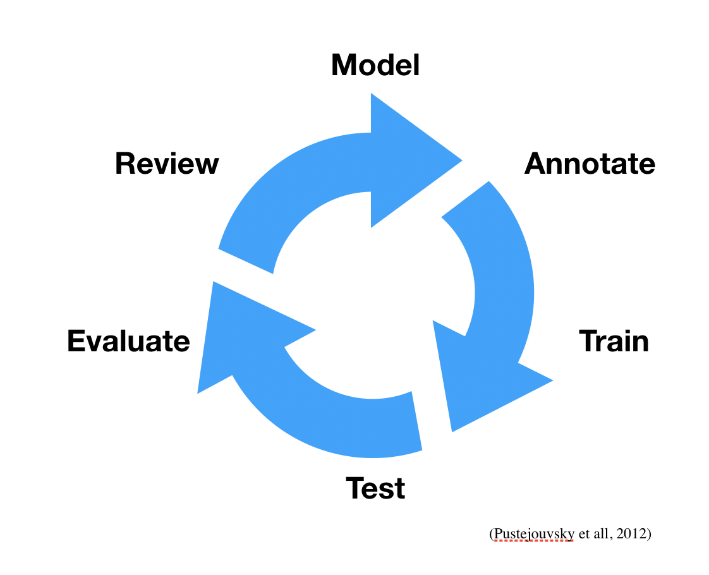

.. _GitLab issues project page: https://gitlab.nims.go.jp/a017873/superconductors-documentation/issues
.. _out-of-the-box: https://grobid.readthedocs.io/en/latest/Training-the-models-of-Grobid

.. _Annotation workflow:

Annotation workflow
~~~~~~~~~~~~~~~~~~~

This page describes the workflow followed when creating a new annotation corpus of training data.

.. _matter link:

Introduction: The "MATTER" approach
===================================

We follow the `Grobid <https://github.com/kermitt2/grobid>`_ approach, which follows the more general MATTER approach: Model, Annotate, Train, Test, Evaluate, Revise (Pustejouvsky et all, 2012).

Since the operations of Train, Tests and Evaluation are provided by Grobid `out-of-the-box`_. We can simplify the workflow as follow, where only five steps are taken in consideration:
 - Pre-annotation
 - Correction
 - Cross-validation / Cross-checking
 - Training & Evaluation
 - Review (annotations, model and guidelines)

Workflow
========

In this section we describe in detail the workflow.

First and foremost. At each iteration (see above) we process a set of documents which is called ``batch``, later we will use the notation ``batch-1``, ``batch-2``, ... ``batch-n`` to refer to specific group of documents that were added to the dataset.

The workflow is further described:

**Pre-annotation**: The first step of the annotation process is to generate pre-annotated data from unlabeled documents using the latest implementation available (this can be statistical model recently trained but also a rule-based algorithm).
The pre-annotated data is generated from input documents: it is bad practice to add artificial/fake data manually, because it biases the statistical distribution and false the results.

Each pre-annotation task automatically generate all the necessary annotated training data for all the models involved. Our system (Grobid), automatically take care of generating such data for each model in the cascade. These annotation should improve, as the model is trained with more data: after several cycle of iteration the user should have the feeling that the amount of correction are decreasing.

.. Let's take an example. Let's suppose there is a model for extracting date and time (``date-time-extraction``) and two cascade model ``date-parsing`` and ``time-parsing`` to parse respectively the results into day/month/year and hour/minute.
.. For each input file (``file1.pdf``), there will be three pre-annotated output files: ``file1.date-time-extraction.xml``, ``file1.date-parsing.xml`` and ``file1.time-parsing.xml``.
.. The output files have same prefix (to match with the input name) and different suffixes.
.. In this project we are developing a tool called `grobid-superconductors` and available on `GitHub <https://github.com/lfoppiano/grobid-superconductors>`_ which ships a CRF and (optionally actionable) deep learning set of models.

.. Assuming that the tool has been installed correctly, data can be pre-annotated using the following command:

..   java -jar build/libs/grobid-supeconductors-*.onejar.jar trainingGeneration -m superconductors -dIn path/input/pdf -dOut path/output/generated resources/config/config.yml

.. The data is read from the ``path/input/pdf`` directory and written in ``path/output/generated``.

.. **Training data directory structure:**
.. The default path in Grobid is ``resources/dataset/${model}/corpus``.
.. Inside this directory, there are:
 - input sub-directories, ``pdf``, ``txt``, ``XML`` containing the source pdf, text or XML, respectively
 - training data sub-directories,
    - ``generated`` containing the semi-automatic generated files,
    - ``staging`` as intermediary directory, used as a buffer for the data waiting for cross-validation,
    - ``final`` for the document that has been corrected and cross-validated.

**Correction** (Annotation):
The correction work (mentioned later as Annotation) consists of manually checking the documents and adding/removing or modifying the annotated information.

.. note:: It is essential not to modify the text content in these generated files, nor adding spaces or other characters, but only adding or moving labels.

The correction must be performed by following the guidelines which are growing with the expertise of the annotators. It's is very important that all mistakes and information are kept up-to-date in the documentation.
In such case, the procedure is to open a new issue in the `GitLab issues project page`_ and follow the discussion there. Written discussions will facilitate, in future, the understanding of certain decisions.

**Cross-validation** (Curation): Every annotated document is verified and validated by a different domain expert before it's considered finished.
This process aims to to reduce the amount of mistakes due to distraction and to consolidate the guidelines with a secondary check on the same document.

**Training / Evaluation**: Training and evaluation is performed and the results examined.
The results (Precision, Recall, F-score) for all the models have been obtained using 10-fold cross-validation (average metrics over the 10 folds).

.. The training data will be picked up from ``resources/dataset/{model}/corpus/final``. The evaluation is automatically performed using about 20% of the total corpus. Note that the unit of training (or so-called instance of training) is the paragraph. This means that each training file is split into several paragraphs, and these are randomly assigned to training or evaluation on the 80/20 probability rate.

**Review**: At the end of each iteration, we review the evaluation improvements or regressions. Plan new changes or a new batch of documents to be corrected in the next iteration. in this phase also the model and the guidelines are reviewed.

